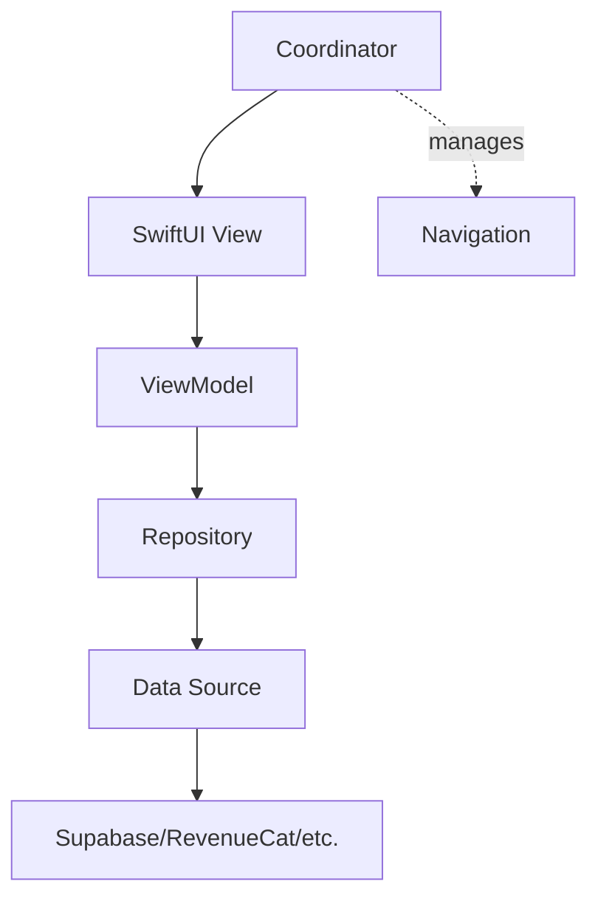
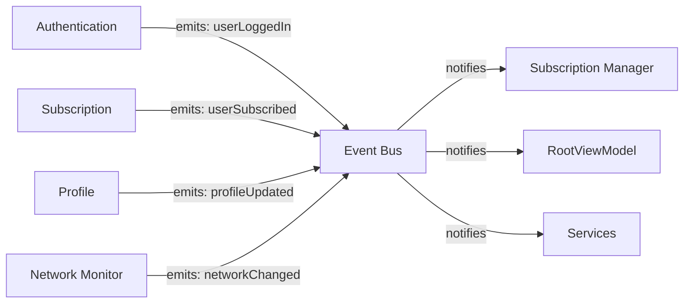
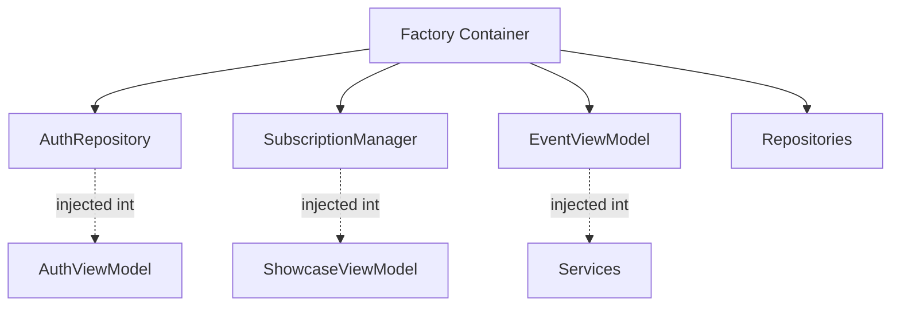
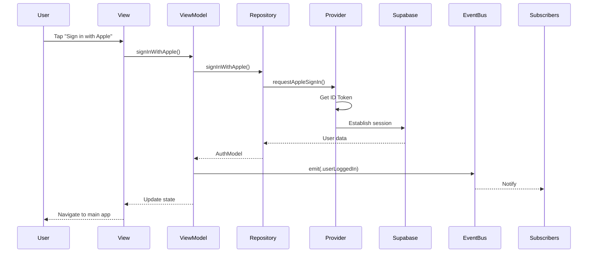
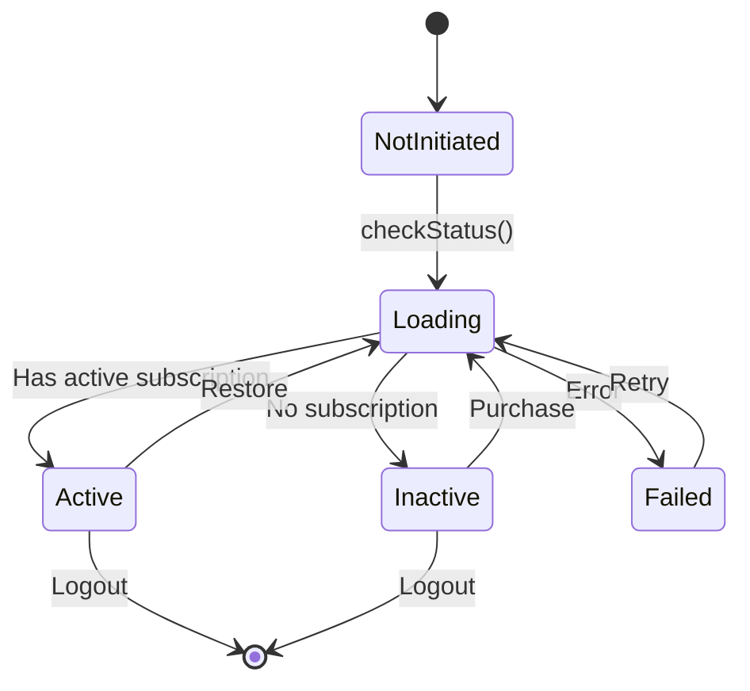
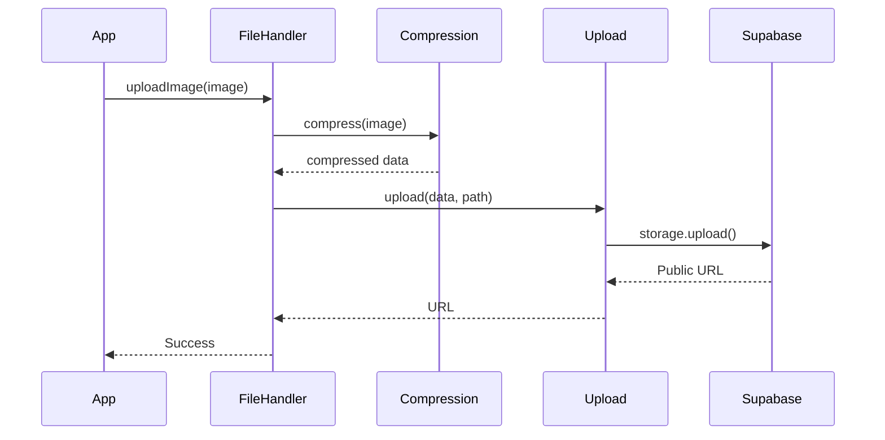
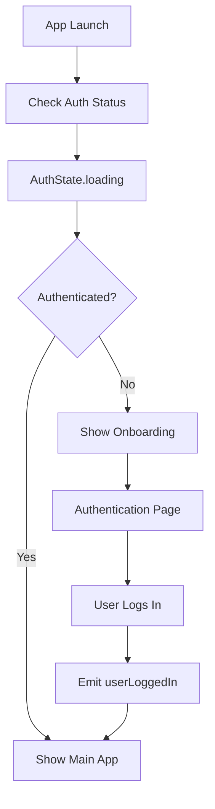
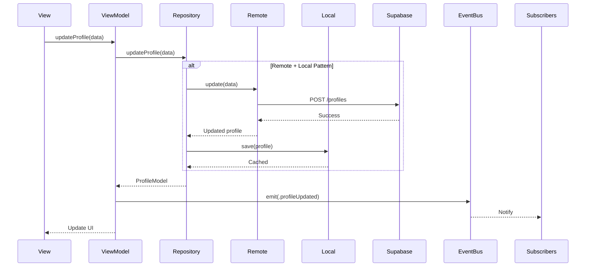

# Architecture Guide

This guide provides a deep dive into the technical architecture of the iOS Starter Kit.

---

## Table of Contents

- [Project Structure](#project-structure)
- [Architecture Patterns](#architecture-patterns)
- [Module Breakdown](#module-breakdown)
- [State Management](#state-management)
- [Navigation System](#navigation-system)
- [Dependency Injection](#dependency-injection)
- [Data Flow](#data-flow)
- [Testing Strategy](#testing-strategy)

---

## Project Structure

The project follows a **modular, feature-based architecture** with clear separation of concerns:

```
ios-starter-kit/
├── Src/
│   ├── iOSJumpstart/                  # Main app target
│   │   ├── App/                       # App root and navigation
│   │   │   ├── RootView.swift         # App entry point
│   │   │   ├── RootViewModel.swift    # Central state management
│   │   │   ├── MainTabView.swift      # Tab bar navigation
│   │   │   ├── Onboarding/            # 5-page onboarding flow
│   │   │   │   ├── OnboardingView.swift
│   │   │   │   └── Pages/             # Welcome, Features, Personalize, etc.
│   │   │   └── Tabs/                  # Main app tabs
│   │   │       ├── Showcase/          # Feature showcase
│   │   │       └── More/              # Settings and profile
│   │   ├── Services/                  # App-level services
│   │   │   ├── NetworkMonitor/        # Connectivity monitoring
│   │   │   ├── AppUpdateChecker/      # Version checking
│   │   │   ├── NotificationService/   # Push notifications
│   │   │   ├── DeepLinkService/       # Deep link routing
│   │   │   └── ReviewManager/         # App Store reviews
│   │   ├── Assets.xcassets            # App icons, images
│   │   ├── Fonts/                     # Custom fonts (Poppins)
│   │   ├── Info.plist                 # App configuration
│   │   └── iOSJumpstart.entitlements  # Capabilities
│   │
│   └── Features/                      # Feature modules (frameworks)
│       ├── Authentication/            # Auth system
│       │   ├── Core/                  # Business logic
│       │   │   ├── AuthRepository.swift
│       │   │   ├── AuthStatusRepository.swift
│       │   │   └── Models/            # AuthModel, AuthError
│       │   ├── Data/                  # Data layer
│       │   │   ├── KeychainService/   # Secure storage
│       │   │   └── Repository/        # Provider implementations
│       │   ├── View/                  # UI components
│       │   │   ├── AuthenticationPage.swift
│       │   │   ├── AuthenticationSheet.swift
│       │   │   └── AuthenticationViewModel.swift
│       │   └── AuthCoordinator.swift  # View composition
│       │
│       ├── Subscription/              # In-app purchases
│       │   ├── SubscriptionManager.swift
│       │   ├── Services/
│       │   │   └── RevenueCatService.swift
│       │   └── Models/                # Subscription models
│       │
│       ├── Events/                    # Event bus
│       │   ├── EventViewModel.swift   # Pub/sub system
│       │   └── EventFactory.swift     # DI registration
│       │
│       ├── Repositories/              # Data access
│       │   ├── SupabaseClient/        # Supabase singleton
│       │   ├── ProfileRepository/     # User profiles
│       │   ├── LocalStorageManager/   # SwiftData wrapper
│       │   └── Mods/                  # Feature-specific data
│       │
│       ├── FileHandler/               # File operations
│       │   ├── FileHandler.swift      # Main API
│       │   ├── SupabaseUploadRepository.swift
│       │   └── ImageCompressionService.swift
│       │
│       └── Common/                    # Shared utilities
│           ├── Configuration/         # AppConfiguration
│           ├── Networking/            # HTTP client
│           ├── Theme/                 # Colors, typography
│           ├── UI/                    # Reusable components
│           └── Extensions/            # Swift extensions
│
└── docs/                              # Documentation
    ├── README.md
    ├── SETUP.md
    ├── ARCHITECTURE.md                # You are here
    ├── SUPABASE_SETUP_GUIDE.md
    ├── REVENUECAT_SETUP_GUIDE.md
    ├── CONTRIBUTING.md
    ├── TROUBLESHOOTING.md
    └── DEPLOYMENT.md
```

---

## Architecture Patterns

### 1. MVVM + Coordinator

**Model-View-ViewModel** pattern with **Coordinator** for navigation and composition.



**Example: Authentication Flow**

```swift
// View (SwiftUI)
struct AuthenticationPage: View {
    @StateObject private var viewModel = AuthenticationViewModel()

    var body: some View {
        VStack {
            Button("Sign in with Apple") {
                viewModel.signInWithApple()
            }
        }
    }
}

// ViewModel (ObservableObject)
@MainActor
final class AuthenticationViewModel: ObservableObject {
    @Published var authState: Loadable<AuthModel> = .notInitiated
    @Injected(\.authRepository) private var authRepository

    func signInWithApple() async {
        authState = .loading(existing: nil)
        do {
            let user = try await authRepository.signInWithApple()
            authState = .success(user)
        } catch {
            authState = .failure(error)
        }
    }
}

// Repository (Protocol)
protocol AuthRepository {
    func signInWithApple() async throws -> AuthModel
}

// Coordinator (View Composition)
protocol AuthCoordinator {
    associatedtype AuthPage: View
    func authenticationPage(onSuccess: @escaping () -> Void) -> AuthPage
}
```

**Benefits**:
- ✅ Testable: ViewModels can be unit tested
- ✅ Separation: Business logic separate from UI
- ✅ Reusable: Repositories shared across features

---

### 2. Event-Driven Architecture

**Decoupled communication** between modules using an event bus.



**Implementation: EventViewModel**

```swift
// Location: Src/Features/Events/Events/EventViewModel.swift

@Observable
public final class EventViewModel {
    // Event types
    public enum Event {
        case userLoggedIn
        case userLoggedOut
        case profileUpdated
        case userSubscribed
        case appRatingRequested
        case networkConnectivityChanged(isConnected: Bool)
    }

    // Event categories
    public enum EventType {
        case authentication
        case profile
        case subscription
        case appRating
        case network
    }

    // Subscriptions
    private var subscriptions: [ObjectIdentifier: (eventTypes: Set<EventType>, handler: (Event) -> Void)] = [:]

    // Subscribe to specific event types
    public func subscribe(
        for subscriber: AnyObject,
        to eventTypes: Set<EventType>,
        handler: @escaping (Event) -> Void
    ) {
        subscriptions[ObjectIdentifier(subscriber)] = (eventTypes, handler)
    }

    // Emit event
    public func emit(_ event: Event) {
        let eventType = event.eventType
        for (_, subscription) in subscriptions where subscription.eventTypes.contains(eventType) {
            subscription.handler(event)
        }
    }
}
```

**Usage Example: SubscriptionManager**

```swift
// Location: Src/Features/Subscription/Subscription/SubscriptionManager.swift

public final class SubscriptionManager: ObservableObject {
    @Injected(\.eventViewModel) private var eventViewModel

    init() {
        // Subscribe to authentication events
        eventViewModel.subscribe(for: self, to: [.authentication]) { [weak self] event in
            switch event {
            case .userLoggedIn:
                Task { await self?.refreshSubscriptionStatus() }
            case .userLoggedOut:
                self?.clearSubscriptionData()
            default:
                break
            }
        }
    }
}
```

**Benefits**:
- ✅ Decoupled: Modules don't know about each other
- ✅ Scalable: Add new subscribers without changing emitters
- ✅ Testable: Easy to mock event emissions

---

### 3. Dependency Injection (Factory Pattern)

Using the **Factory** library for compile-time safe dependency injection.



**Container Registration**

```swift
// Location: Src/Features/Authentication/Authentication/AuthFactory.swift

import Factory

public extension Container {
    // Singleton: Event bus (one instance app-wide)
    var eventViewModel: Factory<EventViewModel> {
        Factory(self) { EventViewModel() }
            .singleton
    }

    // Shared: Subscription manager (shared across features)
    var subscriptionManager: Factory<SubscriptionManager> {
        self { SubscriptionManager() }
            .scope(.shared)
    }

    // Factory: New instance each time
    var authRepository: Factory<AuthRepository> {
        self { AuthRepositoryImpl() }
    }
}
```

**Injection Points**

```swift
// @Injected: Direct injection (resolved immediately)
@Injected(\.authRepository) private var authRepository

// @LazyInjected: Lazy injection (resolved on first access)
@LazyInjected(\.subscriptionManager) private var subscriptionManager
```

**Benefits**:
- ✅ Type-safe: Compile-time checking
- ✅ Testable: Easy to replace with mocks
- ✅ Scopes: Singleton, Shared, Factory

---

## Module Breakdown

### Authentication Module

**Location**: `Src/Features/Authentication/`

**Purpose**: Handle Apple Sign-In and Google OAuth with session management.

**Structure**:
```
Authentication/
├── Core/
│   ├── AuthRepository.swift           # Main auth interface
│   ├── AuthStatusRepository.swift     # Session checking
│   ├── AuthProviders.swift            # Provider protocols
│   └── Models/
│       ├── AuthModel.swift            # User model
│       └── AuthError.swift            # Error types
├── Data/
│   ├── KeychainService/               # Secure token storage
│   └── Repository/
│       ├── AppleAuthProvider.swift    # Apple Sign-In
│       └── GoogleAuthProvider.swift   # Google OAuth
├── View/
│   ├── AuthenticationPage.swift       # Full-page view
│   ├── AuthenticationSheet.swift      # Sheet presentation
│   └── AuthenticationViewModel.swift  # View state
└── AuthCoordinator.swift              # View composition
```

**Auth Flow**:



**Key Files**:
- `RootViewModel.swift:45` - Auth state management
- `AuthRepository.swift:120` - Sign-in methods
- `AuthenticationPage.swift:67` - UI implementation

---

### Subscription Module

**Location**: `Src/Features/Subscription/`

**Purpose**: RevenueCat integration for in-app purchases.

**Structure**:
```
Subscription/
├── SubscriptionManager.swift          # Observable state
├── Services/
│   └── RevenueCatService.swift        # RevenueCat SDK wrapper
├── Models/
│   ├── SubscriptionModel.swift        # Subscription data
│   └── SubscriptionError.swift        # Error types
└── SubscriptionCoordinator.swift      # Paywall composition
```

**Subscription State Machine**:



**Integration with Events**:

```swift
// Location: Src/Features/Subscription/Subscription/SubscriptionManager.swift:67

init() {
    // Subscribe to authentication events
    eventViewModel.subscribe(for: self, to: [.authentication]) { [weak self] event in
        switch event {
        case .userLoggedIn:
            Task { await self?.refreshSubscriptionStatus() }
        case .userLoggedOut:
            self?.subscriptionStatus = .inactive
        default:
            break
        }
    }
}
```

**Key Files**:
- `SubscriptionManager.swift:89` - Status checking
- `RevenueCatService.swift:45` - SDK integration
- `ShowcaseTab.swift:120` - UI display

---

### Events Module

**Location**: `Src/Features/Events/`

**Purpose**: Event bus for cross-module communication.

**Event Types**:

| Event | Emitter | Subscribers |
|-------|---------|-------------|
| `userLoggedIn` | Authentication | Subscription, Profile, RootViewModel |
| `userLoggedOut` | Authentication | Subscription, Profile, RootViewModel |
| `profileUpdated` | Profile | More Tab |
| `userSubscribed` | Subscription | RootViewModel, Showcase |
| `networkConnectivityChanged` | NetworkMonitor | RootViewModel |

**Key Files**:
- `EventViewModel.swift:34` - Event bus implementation

---

### Repositories Module

**Location**: `Src/Features/Repositories/`

**Purpose**: Data access layer supporting local (SwiftData), remote (Supabase), or both.

**Three Patterns**:

| Pattern | Use Case | Implementation |
|---------|----------|----------------|
| **Remote Only** | Always online, simple apps | Direct Supabase calls |
| **Local Only** | Offline-first, no backend | SwiftData only |
| **Local + Remote** | Offline support with sync | Local cache + Supabase sync |

See **[Repositories/README.md](../Src/Features/Repositories/Repositories/README.md)** for detailed implementation guides.

**Key Files**:
- `SupabaseClient.swift:23` - Singleton client
- `ProfileRepository.swift:45` - User profile CRUD
- `LocalStorageManager.swift:67` - SwiftData configuration

---

### FileHandler Module

**Location**: `Src/Features/FileHandler/`

**Purpose**: File upload with automatic compression.

**Upload Flow**:



**Key Files**:
- `FileHandler.swift:34` - Main API
- `ImageCompressionService.swift:56` - Compression logic
- `SupabaseUploadRepository.swift:78` - Upload implementation

---

### Common Module

**Location**: `Src/Features/Common/`

**Purpose**: Shared utilities, theme, networking, and UI components.

**Contents**:
- **Configuration**: `AppConfiguration.swift` - Centralized config
- **Networking**: `HTTPNetworking.swift` - Async HTTP client
- **Theme**: Colors, typography, spacing
- **UI Components**: Buttons, text fields, navigation helpers

**Key Files**:
- `AppConfiguration.swift:15` - All service credentials
- `HTTPNetworking.swift:45` - Network layer
- `Theme/Colors.xcassets` - Color system

---

## State Management

### 1. RootViewModel (Central State)

**Location**: `Src/iOSJumpstart/iOSJumpstart/App/RootViewModel.swift`

**Purpose**: Manage app-wide authentication and subscription state.

```swift
@MainActor
final class RootViewModel: ObservableObject {
    // Authentication state
    @Published private(set) var authState: AuthState = .loading

    // Subscription state
    @Published private(set) var didSubscribe = false

    // Dependencies
    @Injected(\.authStatusRepository) private var authRepository
    @Injected(\.eventViewModel) private var eventViewModel
    @Injected(\.subscriptionManager) private var subscriptionManager

    // Auth state enum
    enum AuthState: Equatable {
        case loading
        case result(isAuthenticated: Bool)
    }
}
```

**State Flow**:



---

### 2. Loadable<T> Pattern

**Location**: `Src/Features/Common/Common/Utility/Loadable.swift`

**Purpose**: Generic wrapper for async loading states.

```swift
public enum Loadable<T> {
    case notInitiated
    case loading(existing: T?)
    case success(T)
    case failure(Error)
    case empty

    var value: T? {
        switch self {
        case .loading(let existing): return existing
        case .success(let value): return value
        default: return nil
        }
    }
}
```

**Usage**:

```swift
@Published var profileData: Loadable<ProfileModel?> = .notInitiated

func loadProfile() async {
    profileData = .loading(existing: profileData.value)
    do {
        let profile = try await repository.getProfile()
        profileData = profile != nil ? .success(profile) : .empty
    } catch {
        profileData = .failure(error)
    }
}
```

---

### 3. Observable vs ObservableObject

**Modern (@Observable)**: Used in iOS 17+ (this kit uses iOS 18+) for better performance.

```swift
import Observation

@Observable
public final class NetworkMonitor {
    public var isConnected: Bool = true
    public var connectionType: ConnectionType = .wifi
}
```

**Legacy (@ObservableObject)**: Used for backward compatibility.

```swift
@MainActor
final class RootViewModel: ObservableObject {
    @Published var authState: AuthState = .loading
}
```

---

## Navigation System

### Type-Safe Navigation with AppRoute

**Location**: `Src/iOSJumpstart/iOSJumpstart/App/Navigation/`

**AppRoute Enum**:

```swift
enum AppRoute: Hashable {
    case myProfile
    // Add more routes as needed
}
```

**AppNavigator**:

```swift
@MainActor
final class AppNavigator: ObservableObject {
    @Published var path = NavigationPath()

    func navigate(to route: AppRoute) {
        path.append(route)
    }

    func pop() {
        guard !path.isEmpty else { return }
        path.removeLast()
    }

    func popToRoot() {
        path = NavigationPath()
    }
}
```

**Navigation Flow**:

```swift
// In RootView
NavigationStack(path: $navigator.path) {
    MainTabView()
        .navigationDestination(for: AppRoute.self) { route in
            destinationView(for: route)
        }
}
.environmentObject(navigator)

// Navigate from anywhere
@EnvironmentObject var navigator: AppNavigator

Button("View Profile") {
    navigator.navigate(to: .myProfile)
}
```

---

## Data Flow

### Complete Data Flow Example: Profile Update



---

## Testing Strategy

### Unit Testing Structure

```
ProjectTests/
├── AuthenticationTests/
│   ├── AuthRepositoryTests.swift
│   └── Mocks/
│       └── MockAuthProvider.swift
├── SubscriptionTests/
│   └── SubscriptionManagerTests.swift
└── EventsTests/
    └── EventViewModelTests.swift
```

### Mocking with Factory

```swift
// Test setup
class AuthRepositoryTests: XCTestCase {
    override func setUp() {
        super.setUp()

        // Register mock
        Container.shared.authRepository.register {
            MockAuthRepository()
        }
    }

    func testSignIn() async throws {
        let repository = Container.shared.authRepository()
        let user = try await repository.signInWithApple()
        XCTAssertNotNil(user)
    }
}
```

---

## Build Configuration

### Debug vs Release

```swift
// In AppConfiguration.swift
public enum Environment {
    #if DEBUG
    public static let isDebug = true
    #else
    public static let isDebug = false
    #endif
}

public enum Supabase {
    #if DEBUG
    public static let url = "https://debug-project.supabase.co"
    public static let anonKey = "DEBUG_KEY"
    #else
    public static let url = "https://prod-project.supabase.co"
    public static let anonKey = "PROD_KEY"
    #endif
}
```

### Framework Dependencies

**Swift Package Manager**:
- Supabase SDK
- RevenueCat SDK
- Firebase (Core, Analytics, Messaging)
- Factory (DI)
- GoogleSignIn
- Nuke (Image loading)

---

## Summary

This architecture provides:

✅ **Modularity**: Features as independent frameworks
✅ **Scalability**: Easy to add new features
✅ **Testability**: Protocol-based with DI
✅ **Maintainability**: Clear separation of concerns
✅ **Performance**: Modern Swift concurrency
✅ **Type Safety**: Compile-time checking throughout

**Next Steps**:
- Review [CONTRIBUTING.md](./CONTRIBUTING.md) for development guidelines
- See [SETUP.md](./SETUP.md) for initial configuration
- Check [TROUBLESHOOTING.md](./TROUBLESHOOTING.md) for common issues
